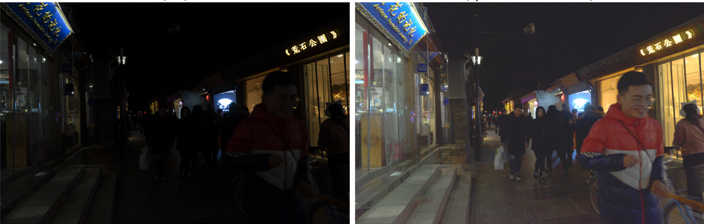

# Zero-Shot Low-Light Image Enhancement using Vision-Language Models and Semantic Diffusion

A zero-shot framework for enhancing low-light images by combining CLIP semantic guidance with Stable Diffusion-based latent diffusion. No paired low-light/normal-light training data is required — the model adapts to each input image independently at inference time.

This is the implementation accompanying the paper *"Zero Shot Low Light Image Enhancement using Vision Language Models and Semantic Diffusion."*

## Overview

Low-light images suffer from reduced visibility, amplified noise, and loss of structural detail. Most learning-based enhancement methods require large paired datasets and can struggle to generalize to unseen lighting conditions. This project instead uses two pretrained models with no task-specific fine-tuning:

- **CLIP (ViT-B/32)** extracts a semantic embedding from the input image, which acts as a reference to ensure the enhanced output preserves the original scene content.
- **Stable Diffusion v1.5** performs iterative denoising (via DDIM sampling) to reconstruct a brighter, cleaner version of the image, guided by a text prompt and constrained by semantic similarity to the original.

A candidate enhancement is only accepted if its CLIP embedding remains above a similarity threshold (0.85) relative to the original image, which prevents the diffusion process from drifting away from the actual scene content.

## Sample Output


*Left: Low-light input | Right: Enhanced output*

## Method Summary

1. Resize and normalize input image to 512–640px resolution
2. Extract CLIP embedding from the input image
3. Apply adaptive gamma correction and color boosting as an initialization step
4. Run 40–50 DDIM denoising steps guided by a text prompt (e.g., "well-lit photograph")
5. At each step, reject candidates whose CLIP similarity to the original drops below 0.85
6. Repeat for 4 enhancement passes
7. Blend traditional enhancement (65%) with the diffusion output (35%) for the final result

Full mathematical formulation (forward/reverse diffusion process, semantic guidance loss) is in the paper.

## Quantitative Results on LOL Dataset

| Type | Model | Reference | PSNR ↑ | SSIM ↑ | LPIPS ↓ | FID ↓ |
|---|---|---|---|---|---|---|
| Unpaired Training | EnlightenGAN | TIP'21 | 17.873 | 0.653 | 0.395 | 102.879 |
| Unpaired Training | CLIP-Lit | ICCV'23 | 12.714 | 0.481 | 0.363 | 120.100 |
| Unpaired Training | NeRco | ICCV'23 | 22.946 | 0.773 | 0.527 | 27.095 |
| Unpaired Training | PairLIE | CVPR'23 | 19.735 | 0.776 | 0.307 | 98.050 |
| Unpaired Training | LightenDiffusion | ECCV'24 | 21.099 | 0.829 | 0.310 | 93.784 |
| Zero-Shot | Zero-DCE | CVPR'20 | 15.053 | 0.582 | 0.602 | 96.571 |
| Zero-Shot | Zero-DCE++ | TPAMI'21 | 14.682 | 0.622 | 0.507 | 85.552 |
| Zero-Shot | RUAS | CVPR'21 | 16.504 | 0.488 | 0.375 | 116.757 |
| Zero-Shot | SCI | CVPR'22 | 14.651 | 0.502 | 0.302 | 81.456 |
| Zero-Shot | GDP | CVPR'24 | 15.896 | 0.402 | 0.572 | 123.362 |
| Zero-Shot | FourierDiff | CVPR'24 | 18.673 | 0.602 | 0.376 | 76.395 |
| Zero-Shot | **Ours** | – | **15.557** | **0.792** | 0.326 | 133.276 |

↑ Higher is better · ↓ Lower is better

**Honest take on these numbers:** PSNR and SSIM are reasonable for a zero-shot method but trail several recent supervised and zero-shot approaches (notably LightenDiffusion and NeRco). FID is the weakest result in the table — likely a consequence of the 65/35 traditional-enhancement/diffusion blend ratio, which favors per-image structural fidelity (helping SSIM) over matching the broader distribution statistics that FID measures. A useful next step would be tuning that blend ratio and testing whether a higher diffusion contribution improves FID without hurting PSNR/SSIM.

## Repository Contents

- `low_light_enhancement.ipynb` — main notebook containing the full pipeline: preprocessing, CLIP embedding extraction, DDIM-guided diffusion enhancement, semantic filtering, and evaluation against LOL/ExDark benchmarks.
- `evaluation_results.json` — raw evaluation metrics.
- `index.html` — project demo page.

## Requirements

```
python>=3.8
torch>=1.10.0
torchvision>=0.11.0
diffusers
clip-by-openai
numpy
opencv-python
pillow
matplotlib
```

## Usage

The pipeline currently runs end-to-end inside the notebook. Open `low_light_enhancement.ipynb`, set the input image path in the configuration cell, and run all cells to produce the enhanced output.

*(A standalone `enhance.py` module with a simple `CLIPEnhancer` class is planned for easier integration into other projects — not yet extracted from the notebook.)*

## Datasets

Evaluation only — no training is performed.

- **LOL Dataset** — 500 paired low-light/normal-light images, used for PSNR/SSIM/LPIPS evaluation.
- **ExDark Dataset** — 7,000+ unpaired extreme low-light images, used for generalization testing with no-reference metrics (MUSIQ).

## Citation

If you reference this work, please cite the accompanying paper: *Zero Shot Low Light Image Enhancement using Vision Language Models and Semantic Diffusion* (Remeshkumar, K., Abhijith, R., Theveril, K. V., Hema, H., Bobby, D. P.).

## License

MIT
